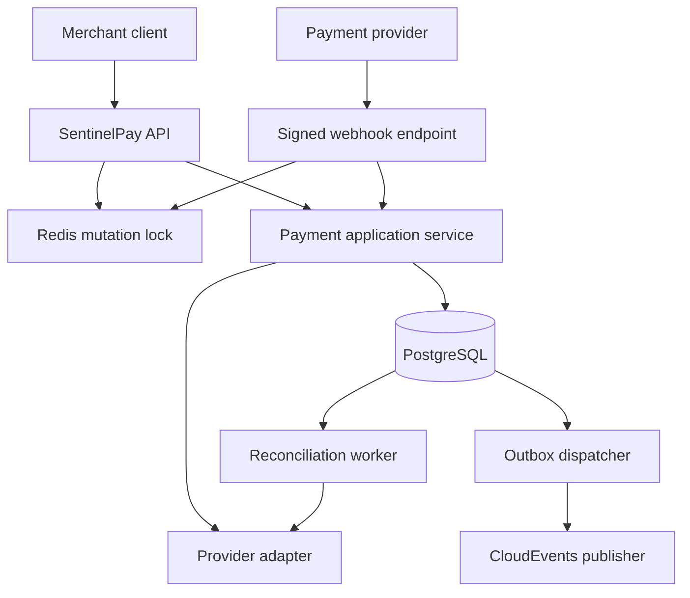

<p align="center">
  
</p>

<p align="center">
  
  
  
  
  
</p>

SentinelPay is a production-minded payment orchestration reference built around the failures that make payment systems difficult: duplicate client requests, concurrent mutations, provider retries, lost events, delayed webhooks, and state drift.

It deliberately uses deterministic sandbox gateways, so the complete authorize → capture → refund lifecycle runs locally without payment credentials or real money.

## What this demonstrates

- Provider-independent authorize, capture, partial refund, and full refund flows
- End-to-end idempotency with payload fingerprinting and replay responses
- Redis-backed mutation locks plus PostgreSQL optimistic concurrency
- Transactional outbox with CloudEvents-compatible envelopes and exponential backoff
- HMAC-authenticated, deduplicated webhook inbox processing
- Background reconciliation for stale provider state
- RFC 9457-style problem responses, rate limiting, health checks, metrics, and traces
- Domain tests and PostgreSQL integration tests powered by Testcontainers
- One-command local environment with Docker Compose

## Architecture



The project follows a pragmatic layered design:

```text
SentinelPay.Domain          Payment aggregate and business invariants
SentinelPay.Application     Use cases and provider/storage abstractions
SentinelPay.Infrastructure  PostgreSQL, Redis, gateways, outbox, reconciliation
SentinelPay.Api             HTTP contract, error mapping, rate limits, telemetry
```

More detail is available in [Architecture](docs/architecture.md) and the [architecture decision records](docs/adr).

## Reliability invariants

| Risk | SentinelPay response |
|---|---|
| Client retries a timed-out request | The same key and payload returns the original payment with `Idempotent-Replay: true`. |
| A key is reused for different data | The API returns `409 idempotency-conflict`; it never guesses intent. |
| Two nodes mutate one payment | Redis serializes the operation; PostgreSQL's row version remains the final concurrency barrier. |
| Database commits but event publication fails | The event remains in the outbox and is retried with bounded exponential backoff. |
| Provider delivers the same webhook repeatedly | The `(provider, eventId)` inbox constraint makes processing idempotent. |
| Local state drifts from the provider | A reconciliation worker inspects stale authorizations and applies forward-only repairs. |
| API crashes after a provider accepts a call | The same idempotency key is forwarded to the adapter, enabling provider-side replay safety. |

## Run it

Prerequisite: Docker with Compose v2.

```bash
cd SentinelPay
docker compose up --build
```

Then open:

- Swagger UI: <http://localhost:8080/swagger>
- Readiness: <http://localhost:8080/health/ready>
- Prometheus metrics: <http://localhost:8080/metrics>

Run the complete authorize/replay/capture/refund scenario (requires `curl` and `jq`):

```bash
./scripts/demo.sh
```

PostgreSQL and Redis are included. The API creates the demo schema on first startup.

## Try the payment lifecycle

Authorize:

```bash
curl -i http://localhost:8080/api/v1/payments \
  -H 'Content-Type: application/json' \
  -H 'Idempotency-Key: create-order-2026-0001' \
  -d '{
    "merchantReference": "order-2026-0001",
    "amountMinor": 12990,
    "currency": "EUR",
    "provider": "mock-bank",
    "paymentMethodToken": "tok_visa"
  }'
```

Capture, replacing `$PAYMENT_ID` with the returned ID:

```bash
curl -i -X POST "http://localhost:8080/api/v1/payments/$PAYMENT_ID/capture" \
  -H 'Idempotency-Key: capture-order-2026-0001'
```

Partially refund €29.90:

```bash
curl -i "http://localhost:8080/api/v1/payments/$PAYMENT_ID/refunds" \
  -H 'Content-Type: application/json' \
  -H 'Idempotency-Key: refund-order-2026-0001-a' \
  -d '{"amountMinor": 2990}'
```

Replay any mutating request unchanged. The API returns the same resource and adds:

```http
Idempotent-Replay: true
```

## Sandbox behavior

Two adapters are available: `mock-bank` and `sandbox-wallet`.

| Provider | Payment method token | Result |
|---|---|---|
| `mock-bank` | `tok_visa` or any normal token | Authorized |
| `mock-bank` | `tok_declined` | Failed with `card_declined` |
| `mock-bank` | `tok_insufficient_funds` | Failed with `insufficient_funds` |
| `sandbox-wallet` | any normal token | Authorized |
| `sandbox-wallet` | `wallet_locked` | Failed with `wallet_locked` |

Provider references are deterministic for a payment and idempotency key. No card number, CVV, or sensitive authentication data is accepted or persisted.

## Signed webhook example

The sandbox webhook contract is:

```json
{
  "id": "evt_2026_0001",
  "type": "payment.captured",
  "providerReference": "mb_auth_..."
}
```

Sign the exact UTF-8 request body with HMAC-SHA256 and send the lowercase or uppercase hexadecimal digest in `X-SentinelPay-Signature`. Development-only secrets live in `appsettings.json`; replace them through environment variables outside local use.

Supported event types are `payment.captured` and `payment.failed`.

## API surface

| Method | Route | Purpose |
|---|---|---|
| `POST` | `/api/v1/payments` | Authorize a payment |
| `GET` | `/api/v1/payments/{paymentId}` | Read current state |
| `POST` | `/api/v1/payments/{paymentId}/capture` | Capture an authorization |
| `POST` | `/api/v1/payments/{paymentId}/refunds` | Create a partial/full refund |
| `GET` | `/api/v1/providers` | List configured adapters |
| `POST` | `/api/v1/webhooks/{provider}` | Process a signed provider event |

Every mutating merchant request requires an `Idempotency-Key` header between 8 and 128 characters.

## Test and verify

```bash
dotnet restore SentinelPay.slnx
dotnet build SentinelPay.slnx --configuration Release --no-restore
dotnet test SentinelPay.slnx --configuration Release --no-build
```

Integration tests start an isolated PostgreSQL container. The test suite covers replay, conflicting payloads, declined authorization, capture, and partial refund behavior. CI runs build, tests, and coverage collection on every push and pull request.

## Security posture

- Stores tokenized payment method identifiers only; never raw PAN/CVV data
- Compares payload hashes and webhook signatures in constant time
- Uses generic public errors while retaining structured server logs and trace IDs
- Applies per-IP fixed-window rate limits
- Runs the application container as a non-root user with a read-only filesystem
- Keeps sandbox secrets explicitly development-only

This repository is an architecture reference, not a PCI DSS-certified processor. Production deployment requires a secrets manager, gateway-specific signing schemes, authentication/authorization, migrations, network policies, key rotation, and an audited compliance boundary. See [SECURITY.md](SECURITY.md).

## Deliberate trade-offs

- Full capture only; refunds can be partial or full.
- Sandbox adapters are deterministic and do not contact external financial systems.
- The default event publisher emits CloudEvents-shaped records to structured logs. `IEventPublisher` is the seam for Kafka, RabbitMQ, or a managed event bus.
- Local startup uses `EnsureCreated` to make the demo one-command. Production systems should run reviewed EF migrations as a separate deployment step.
- Redis locks reduce competing provider calls; provider idempotency and database uniqueness remain mandatory because distributed locks alone cannot guarantee exactly-once execution.

## Repository map

```text
.
├── src/
│   ├── SentinelPay.Api/
│   ├── SentinelPay.Application/
│   ├── SentinelPay.Domain/
│   └── SentinelPay.Infrastructure/
├── tests/
│   ├── SentinelPay.Domain.Tests/
│   └── SentinelPay.IntegrationTests/
├── docs/adr/
├── compose.yml
├── Dockerfile
└── SentinelPay.slnx
```

## License

SentinelPay is available under the [MIT License](LICENSE).
