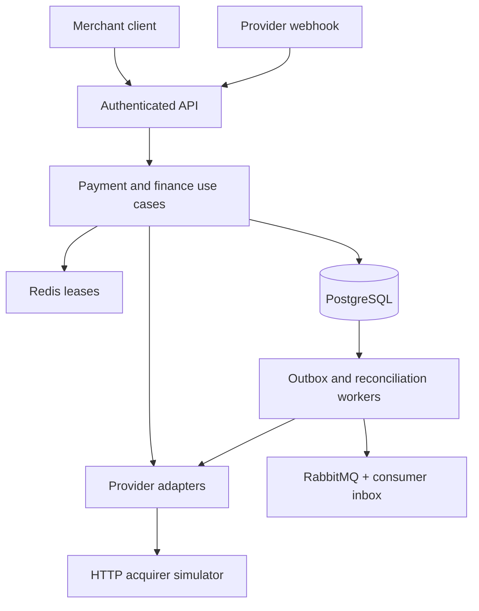

<p align="center">
  
</p>

<p align="center">
  
  
  
  
  
</p>

SentinelPay is a production-minded, multi-tenant payment reliability platform. It focuses on the hard parts of money movement: 3DS/SCA state, ambiguous provider outcomes, partial capture, concurrent retries, ledger correctness, durable event consumption, webhook replay attacks, settlement boundaries, and state drift.

The repository includes deterministic in-process gateways and a separate HTTP acquirer simulator. The full authorize → 3DS challenge → partial capture → void/refund → reconciliation → settlement lifecycle runs locally without real payment credentials or cardholder data.

## Engineering depth

| Capability | Implementation |
|---|---|
| Crash-safe payment operations | A durable `Started/Succeeded/Failed` operation record is committed before each provider mutation. A retry resumes the same operation and forwards the same key. |
| Payment-intent lifecycle | `RequiresAction`, authorization expiry, multiple captures, authorization remainder, void, and refund rules are enforced by one aggregate. |
| Provider boundary | A real `HttpClient` adapter applies timeout budgets, bounded transient retry, `Retry-After`, a shared circuit breaker, stable idempotency keys, response validation, and business-error mapping. |
| Tenant isolation | Hashed API keys resolve a merchant identity and scopes; every merchant-owned query is tenant-filtered. |
| Financial correctness | Immutable, balanced double-entry journals track provider clearing, merchant payable, refunds, and settlement clearing. |
| Durable event delivery | Payment state and outbox intent share one PostgreSQL commit; workers claim with `FOR UPDATE SKIP LOCKED` and publish persistent CloudEvents to RabbitMQ with confirms. |
| Idempotent event consumption | The audit consumer stores `(consumer, eventId)` before ACK, safely acknowledges redelivery, and dead-letters malformed CloudEvents. |
| Failure containment | Bounded exponential retry, claim expiry, dead-letter threshold, per-payment reconciliation isolation, and RFC 9457-style errors. |
| Provider callback security | Timestamped HMAC-SHA256 signatures, constant-time comparison, five-minute replay window, and a deduplicating webhook inbox. |
| Reconciliation evidence | Provider CSV imports classify missing, amount, currency, and state drift into reviewable reports; financial mismatches are never silently rewritten. |
| Operability | Prometheus metrics, OpenTelemetry traces, JSON logs, Grafana dashboard, health probes, load profiles, and executable recovery/chaos drills. |
| Delivery discipline | Reviewed EF migration, Testcontainers integration suite, CodeQL, dependency updates, coverage artifact, and production container build in CI. |

## System shape



The dependency direction remains strict: Domain has no infrastructure dependency; Application owns use cases and ports; Infrastructure implements persistence, locking, messaging, and gateways; API owns transport and identity.

See [the architecture deep dive](docs/architecture.md) for transaction boundaries, failure windows, data ownership, and sequence diagrams.

## Reliability contract

| Failure | Observable behavior |
|---|---|
| Client retries an unchanged request | The original resource is returned with `Idempotent-Replay: true`. |
| Client reuses a key for different data | `409 idempotency-conflict`; no provider call is attempted. |
| API stops after recording intent but before the provider call | The next request resumes the `Started` operation. |
| Provider succeeds but the final database commit is lost | The retry uses the same provider key and converges on the same provider reference. |
| Provider returns `429` or transient `5xx` | The HTTP adapter retries within a bounded budget and preserves the exact provider idempotency key. |
| Two captures race against one authorization | Per-payment lease, durable operation identity, row version, and aggregate remainder prevent over-capture. |
| Event broker is unavailable | Business state commits; the outbox retries independently and dead-letters after the configured limit. |
| Two workers claim pending events | PostgreSQL row locks and `SKIP LOCKED` partition work without holding a transaction over network I/O. |
| Consumer commits but loses its ACK | RabbitMQ redelivers; the consumer inbox recognizes the CloudEvent ID and ACKs without repeating the side effect. |
| Provider sends a duplicate webhook | The `(provider, eventId)` inbox constraint makes the replay harmless. |
| Provider state differs from local state | Reconciliation applies only forward repairs and commits each payment independently. |

SentinelPay promises at-least-once event delivery, not exactly-once transport. The included consumer demonstrates effectively-once local side effects by deduplicating the CloudEvent `id` in PostgreSQL and acknowledging only after commit.

## Run locally

Prerequisite: Docker with Compose v2.

```bash
make configure
make up
curl http://localhost:8080/health/ready
```

`make configure` creates a git-ignored `.env` with random local credentials and never overwrites an existing file.

Local endpoints:

- Swagger: <http://localhost:8080/swagger>
- API: <http://localhost:8080>
- HTTP provider simulator: <http://localhost:8090/health>
- RabbitMQ management: <http://localhost:15672> (`sentinelpay`; password from `.env`)
- Metrics: <http://localhost:8080/metrics>

The development merchant is seeded by the migration initializer. Its sandbox API key and every local service credential are generated into `.env`. No runnable credential is committed. Non-development environments must use a managed secret store and keep `DevelopmentMerchant:Seed=false`.

## Demonstrate the hard paths

```bash
make demo       # authorize, deterministic replay, capture, partial refund
make interview  # 3DS, HTTP provider, partial capture, void, CSV drift report
make recovery   # fail once after operation persistence, then resume safely
make chaos      # stop RabbitMQ, commit payment, restore broker, verify drain
make race       # 25 concurrent requests sharing one idempotency key
```

The standard lifecycle script prints payment state and its operation history. The recovery drill intentionally returns `503` once, then succeeds with the exact same request and idempotency key.

## Observability stack

```bash
make observability
```

Grafana is available at <http://localhost:3000> (`admin`; password from `.env`) with a provisioned SentinelPay Reliability Overview dashboard. Prometheus is available at <http://localhost:9090>.

Custom signals include authorization outcomes, captured/refunded volume, provider latency, circuit opens/rejections, outbox delivery, consumer deduplication/rejection, and dead-letter counts. Set `OTEL_EXPORTER_OTLP_ENDPOINT` to export traces to an OTLP collector.

## API and authorization

Merchant endpoints require `X-Api-Key`. Mutations also require an `Idempotency-Key` of 8–128 characters.

| Scope | Method and route | Purpose |
|---|---|---|
| `payments:write` | `POST /api/v1/payments` | Authorize a payment |
| `payments:read` | `GET /api/v1/payments/{id}` | Read payment and operation history |
| `payments:write` | `POST /api/v1/payments/{id}/confirm` | Confirm a 3DS challenge result |
| `payments:write` | `POST /api/v1/payments/{id}/capture` | Partial, multiple, or final capture |
| `payments:write` | `POST /api/v1/payments/{id}/void` | Close the uncaptured authorization remainder |
| `payments:write` | `POST /api/v1/payments/{id}/refunds` | Partial or full refund |
| `payments:read` | `GET /api/v1/providers` | List provider adapters |
| `ledger:read` | `GET /api/v1/ledger/balances?currency=EUR` | Read account balances |
| `ledger:read` | `GET /api/v1/ledger/journals` | Read recent journal metadata |
| `settlements:write` | `POST /api/v1/settlements` | Move payable funds into settlement clearing |
| `settlements:read` | `GET /api/v1/settlements/{id}` | Read a settlement batch |
| `reconciliation:write` | `POST /api/v1/reconciliation/imports/{provider}` | Import and classify provider CSV drift |
| anonymous + HMAC | `POST /api/v1/webhooks/{provider}` | Receive a provider event |

Example authorization:

```bash
curl -i http://localhost:8080/api/v1/payments \
  -H 'Content-Type: application/json' \
  -H "X-Api-Key: ${SENTINELPAY_API_KEY}" \
  -H 'Idempotency-Key: create-order-2026-0001' \
  -d '{
    "merchantReference": "order-2026-0001",
    "amountMinor": 12990,
    "currency": "EUR",
    "provider": "mock-bank",
    "paymentMethodToken": "tok_visa"
  }'
```

## Double-entry ledger

Every journal must contain at least two positive lines and satisfy total debits = total credits. The domain rejects an unbalanced journal before persistence.

| Event | Debit | Credit |
|---|---|---|
| Capture €40.00 | Provider clearing 4,000 | Merchant payable 4,000 |
| Capture €89.90 | Provider clearing 8,990 | Merchant payable 8,990 |
| Refund €29.90 | Merchant payable 2,990 | Provider clearing 2,990 |
| Settle €100.00 | Merchant payable 10,000 | Settlement clearing 10,000 |

The balance API exposes debits, credits, and `netMinor = credits - debits`. Amounts are always integer minor units; floating-point money is never used.

Settlement creation locks by merchant and currency, selects unassigned payable lines through the requested period end, assigns them to one batch, writes the settlement journal, and emits its outbox event in one unit of work. The sample stops at settlement clearing; it does not pretend to execute a real bank payout.

## Sandbox provider behavior

| Provider | Token | Result |
|---|---|---|
| `mock-bank` | `tok_visa` or normal token | Authorized |
| `mock-bank` | `tok_3ds_challenge` | `RequiresAction`; confirm with `auth_success` or `auth_failed` |
| `mock-bank` | `tok_declined` | `card_declined` |
| `mock-bank` | `tok_insufficient_funds` | `insufficient_funds` |
| `mock-bank` | `tok_transient_once` | First request `503`, same-key retry succeeds |
| `mock-bank` | `tok_timeout` | Retryable provider timeout |
| `sandbox-wallet` | normal token | Authorized |
| `sandbox-wallet` | `wallet_locked` | `wallet_locked` |
| `acquirer-http` | `tok_http_3ds` | HTTP 3DS challenge flow through the separate simulator |
| `acquirer-http` | `tok_http_rate_limited` | First provider call returns `429`; bounded same-key retry succeeds |
| `acquirer-http` | `tok_http_declined` | Provider business decline |
| `acquirer-http` | `tok_http_timeout` | Repeated `504`; operation remains safely retryable |

Provider references are deterministic from operation identity. The API accepts tokenized payment identifiers only and never accepts PAN or CVV.

## Webhook signing

The signature header follows `t=<unix-seconds>,v1=<hex-hmac>`. The signed bytes are:

```text
{timestamp}.{exact UTF-8 request body}
```

Sign with the provider-specific HMAC-SHA256 secret. Signatures outside `Webhooks:SignatureToleranceSeconds` are rejected before JSON parsing or database access. Inbox uniqueness protects against repeated valid deliveries inside the window.

## Test and quality gates

```bash
dotnet restore SentinelPay.slnx
dotnet build SentinelPay.slnx --configuration Release --no-restore
dotnet test SentinelPay.slnx --configuration Release --no-build
```

The suite covers 3DS transitions, authorization expiry, multiple capture and void rules, HTTP provider contracts, operation completion, double-entry balance invariants, API authentication, tenant isolation, request replay/conflict behavior, transient recovery, webhook deduplication/expiry, reconciliation classification, ledger movement, and settlement. Integration tests start an isolated PostgreSQL 18 container with Testcontainers and apply the real migrations.

Load profiles:

```bash
make load
make race
```

CI builds with warnings as errors, runs tests and coverage, builds the production image, and performs scheduled CodeQL analysis. Dependabot tracks NuGet, GitHub Actions, and container dependencies.

## Operational and design documentation

- [Architecture deep dive](docs/architecture.md)
- [Production runbook](docs/runbook.md)
- [Threat model](docs/threat-model.md)
- [Design review / interview guide](docs/design-review.md)
- [Ten-minute interview demo](docs/interview-demo.md)
- [Failure-mode matrix](docs/failure-matrix.md)
- [Architecture decision records](docs/adr)
- [Security policy](SECURITY.md)
- [Changelog](CHANGELOG.md)

## Deliberate boundaries

- The HTTP adapter targets the repository's simulator, not a real financial institution or certification environment.
- Refunds require the authorization to be fully captured or its remainder to be closed first; this keeps the sample state model explicit.
- Settlement records accounting intent; no ACH/SEPA payout rail is implemented.
- API keys are appropriate for this service-to-service sandbox. A production control plane would add key issuance/rotation workflows, managed secrets, audit logs, and possibly mTLS or workload identity.
- Outbox delivery is at least once. The included audit consumer demonstrates inbox deduplication, but every new consumer still owns its side-effect identity.
- This is an architecture reference, not a PCI DSS-certified payment processor.

## Repository map

```text
.
├── src/                         Domain, Application, Infrastructure, API, provider simulator
├── tests/                       Domain and PostgreSQL integration tests
├── docs/adr/                    Decision records
├── load-tests/                  Lifecycle and idempotency-race k6 profiles
├── observability/               Prometheus and provisioned Grafana dashboard
├── scripts/                     Demo, recovery, and chaos drills
├── compose.yml                  API, PostgreSQL, Redis, RabbitMQ, optional k6
├── compose.observability.yml    Prometheus and Grafana overlay
├── Dockerfile                   Non-root, read-only compatible runtime image
└── SentinelPay.slnx
```

## License

SentinelPay is available under the [MIT License](LICENSE).
