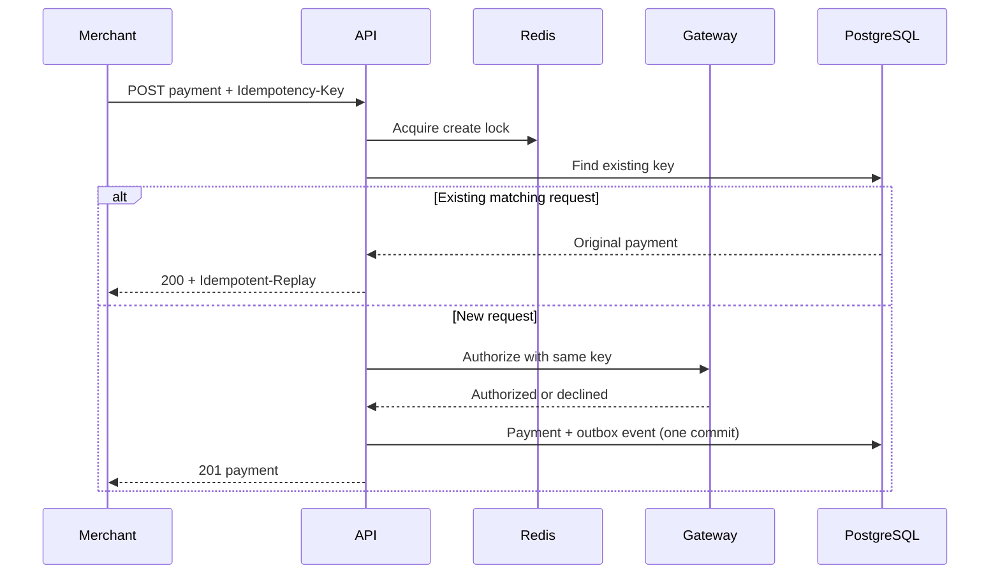
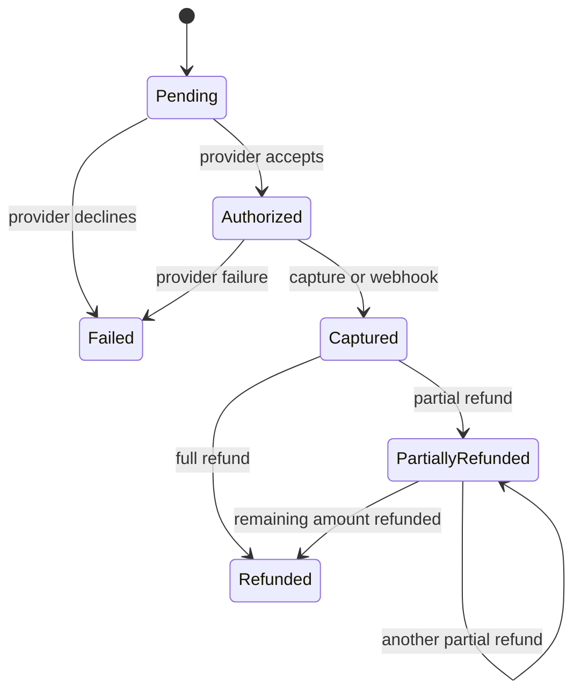

# SentinelPay architecture

## Design objective

SentinelPay protects money-moving state transitions when clients, networks, application instances, and payment providers can all retry independently. Its goal is not broad gateway coverage; its goal is to make reliability decisions visible and testable.

## Authorization sequence

The provider call intentionally precedes the database commit. A crash in that gap is handled by forwarding the merchant idempotency key to the provider adapter. Real adapters must map this to the provider's native idempotency mechanism.

## Transactional outbox

Payment state and its integration event are added to one EF Core unit of work. The dispatcher reads unpublished rows in order, publishes a CloudEvents-compatible envelope, and then stamps `ProcessedAt`. Failures increment `AttemptCount` and schedule a bounded exponential retry.

This produces at-least-once publication. Consumers must deduplicate on the event ID.

## Webhook inbox

Webhook authentication occurs before parsing or database access. Once authenticated:

1. Resolve the provider adapter.
2. Acquire a lock on `(provider, eventId)`.
3. Check the webhook inbox.
4. Resolve the payment by provider reference.
5. Apply a forward-only state transition.
6. Store the inbox receipt and outbox event in the same commit.

The unique `(provider, eventId)` index is the final duplicate barrier.

## Concurrency model

SentinelPay uses layered controls because no single mechanism is sufficient:

- Redis lock: reduces concurrent external calls across application nodes.
- Provider idempotency: protects the remote side of a retried request.
- PostgreSQL uniqueness: rejects duplicate create/refund operation keys.
- PostgreSQL row version: detects stale concurrent aggregate writes.
- State-machine invariants: reject invalid forward or backward transitions.

## State machine

## Observability

The API exports ASP.NET Core, HTTP client, and runtime metrics at `/metrics`. Traces can be sent to any OTLP-compatible collector by setting `OTEL_EXPORTER_OTLP_ENDPOINT`. Logs are JSON and include trace identifiers from the request scope.

Useful production alerts would include:

- outbox oldest-unprocessed age;
- webhook signature failure rate;
- idempotency conflict rate;
- provider latency/error rate by operation;
- stale authorization count;
- reconciliation corrections by provider;
- distributed lock acquisition timeouts.
