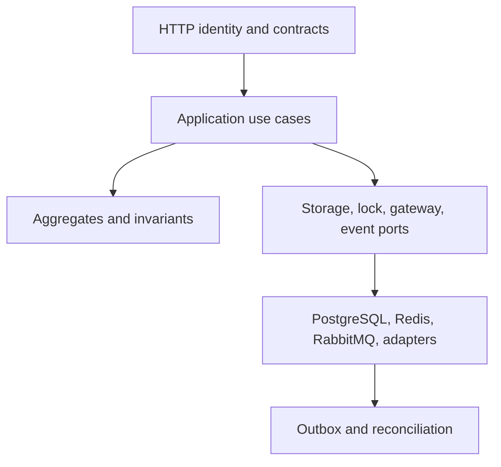
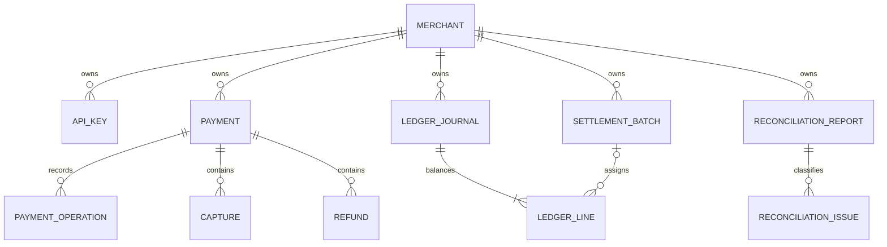
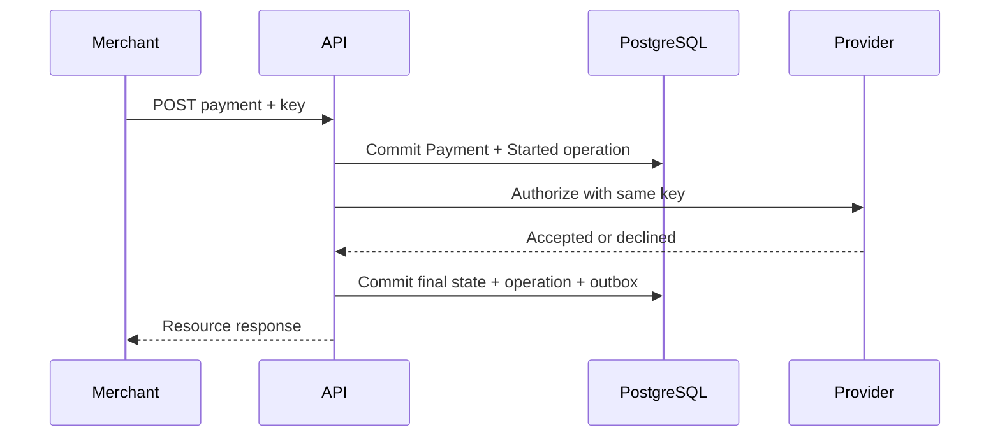
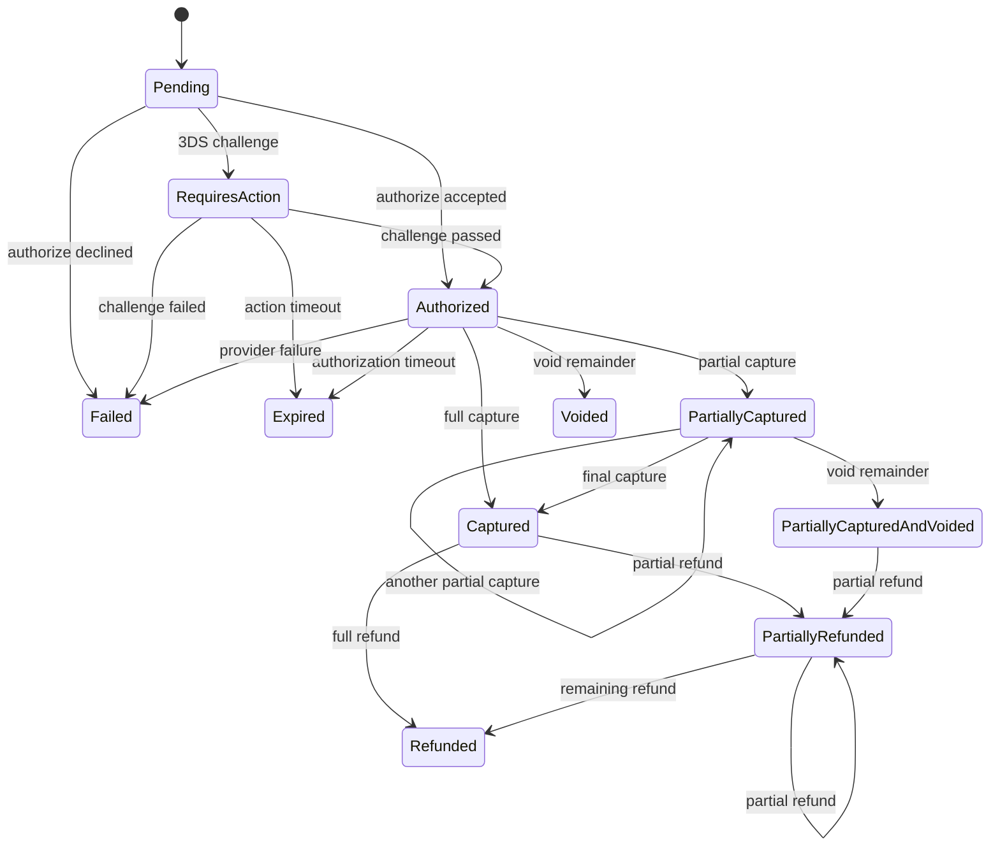

# SentinelPay architecture

## Objective

SentinelPay protects money-moving state when clients, application nodes, databases, brokers, and providers can fail or retry independently. The architecture favors explicit invariants and recoverable intermediate states over claims of exactly-once execution.

The core design questions are:

1. Can a request be retried without creating another remote mutation?
2. Can every captured or refunded amount be explained by balanced entries?
3. Can committed state changes eventually produce events after a broker outage?
4. Can one merchant ever observe another merchant's data?
5. Can an asynchronous cardholder challenge resume without duplicating authorization?
6. Can operators identify and repair incomplete work without guessing?

## Components and ownership

| Layer | Owns | Must not own |
|---|---|---|
| Domain | Payment-intent state machine, captures, operations, refunds, journals, settlement and reconciliation invariants | HTTP, EF Core, broker APIs |
| Application | Use-case ordering, hashes, locks, transaction intent, ports | Provider SDK details, SQL |
| Infrastructure | EF mappings, migration, distributed leases, RabbitMQ, sandbox adapters, workers | HTTP policy or domain rules |
| API | Authentication, authorization, request binding, rate limiting, problem responses, telemetry wiring | Financial calculations |

## Data model

PostgreSQL foreign keys enforce ownership edges. Tenant-owned lookups include `MerchantId`; provider-reference lookup is the deliberate exception used only after a valid provider signature and relies on a globally unique `(Provider, ProviderReference)` index.

## Crash-safe authorization

The first commit is intentional. It proves that SentinelPay knows the operation identity before it performs remote work. A matching retry loads the durable `Started` record and resumes the provider call with the same idempotency key.

Authentication confirmation, capture, void, and refund use the same shape. Capture and refund eligibility are checked before the provider call, preventing a remote mutation that the local aggregate would later reject. The durable operation ID also becomes the local capture/refund ID, so a resumed attempt retains one identity across the provider and database failure window.

## HTTP provider boundary

`ProviderHttpGateway` calls a separate acquirer simulator through `HttpClient`. Mutation requests contain the same durable provider idempotency key on every attempt. The adapter distinguishes:

- completed business outcomes (`declined`, invalid amount): map and return without retry;
- transient transport outcomes (`408`, `429`, `5xx`, connection loss): bounded retry with jitter and `Retry-After` support;
- repeated exhausted failures: open a shared circuit, then permit one half-open probe after the break interval;
- exhausted ambiguity: surface a retryable provider-unavailable result while leaving the operation `Started`.

The simulator is a contract fixture, not a fake implementation hidden inside the adapter. It owns provider-side idempotency responses and state, allowing local tests and demos to cross a real HTTP serialization and timeout boundary.

### Failure-window analysis

| Failure window | Durable state | Recovery |
|---|---|---|
| Before the initial commit | Nothing | Retry starts normally; no provider call occurred. |
| After initial commit, before provider call | `Started` operation | Retry resumes that operation. |
| After provider acceptance, before final commit | `Started` operation; provider may have changed | Retry sends the same provider key and receives the deterministic/native replay result. |
| After final commit, before HTTP response | Final payment, completed operation, outbox row | Retry returns the stored resource. |
| After broker publish, before `ProcessedAt` | Published event and pending row | Dispatcher may publish again; consumer deduplicates by CloudEvent ID. |

This design depends on real provider adapters honoring their native idempotency contract. A provider without such a capability needs a provider-specific lookup/reconciliation strategy and cannot offer the same guarantee.

## Idempotency semantics

Operation identity is `(MerchantId, OperationType, IdempotencyKey)`. The request fingerprint is a SHA-256 digest over a version-stable, delimiter-separated canonical field list.

- Same key + same fingerprint + completed operation: return stored result.
- Same key + same fingerprint + started operation: resume with the same provider key.
- Same key + different fingerprint: return `409`.
- New key against a state that cannot perform the operation: reject through the domain state machine.
- Provider decline: complete the operation as `Failed`; later matching retries replay that failure rather than calling the provider again.

Redis leases reduce simultaneous remote calls. They are not a correctness boundary: a lease can expire or be lost. Database uniqueness, optimistic concurrency, provider idempotency, and domain transitions remain the final barriers.

## Payment state machine

Backward transitions are not exposed. Reconciliation is forward-only.

## Ledger and settlement

The ledger is append-only at the domain level. `LedgerJournal.Create` materializes all lines only after verifying:

- merchant and external reference exist;
- currency is normalized;
- at least two positive lines exist;
- sum(debits) equals sum(credits).

Journal external references are unique, making journal production idempotent. Each capture posts its own amount under `capture:{captureId}`; cumulative payment totals are never reposted. Refund decreases merchant payable; settlement transfers the selected payable balance to settlement clearing.

Settlement runs under a `(merchant, currency)` lease. It selects unassigned `MerchantPayable` lines through `PeriodEnd`, computes credit minus debit, creates one batch, assigns the source lines, creates the balancing settlement journal, and adds an outbox event in the same EF Core unit of work.

The batch remains `Pending`; a real payout adapter and bank-confirmation workflow are deliberately outside this sample.

## Transactional outbox

State changes and event intent commit together in PostgreSQL. Dispatch has two phases:

1. A short transaction claims eligible rows using `FOR UPDATE SKIP LOCKED`, recording worker and claim expiry.
2. Outside that transaction, the worker publishes a persistent CloudEvent through a long-lived RabbitMQ channel with publisher confirmations, then marks the row processed.

Failed publications use bounded exponential backoff. After `Outbox:MaxAttempts`, the row receives `DeadLetteredAt` and stops competing with healthy traffic. A dedicated metric and error log expose the condition.

The audit queue is durable and bound to the topic exchange with `#`. Its consumer uses manual ACK and stores a unique `(consumer,eventId)` row in PostgreSQL before acknowledgement. A stop after commit but before ACK therefore becomes a harmless redelivery. Invalid CloudEvent envelopes are rejected to a dedicated DLQ; transient database failures are requeued.

## Webhook ingress

Authentication occurs before parsing or data access:

1. Parse `t=<unix-seconds>,v1=<digest>`.
2. Reject a timestamp outside the configured tolerance.
3. Compute HMAC-SHA256 over `{timestamp}.{rawBody}`.
4. Compare digests in constant time.
5. Resolve and validate the event.
6. Lock and check `(provider, eventId)` inbox identity.
7. Apply a forward transition, ledger journal, inbox receipt, and outbox event in one commit.

Timestamp validation limits captured-signature replay; inbox uniqueness handles legitimate provider redelivery.

## Reconciliation

Online reconciliation discovers stale authorized or partially captured payments without tracking, then handles each ID in its own dependency-injection scope and database unit of work. One provider timeout or malformed result does not discard corrections already applied to other payments.

External states are interpreted as:

| Provider state | Local action |
|---|---|
| Authorized | No change |
| Partially captured or captured | Post only the positive capture delta, write its journal, record operation, emit event |
| Voided | Close the local authorization remainder and emit event |
| Failed | Mark failed, record reconcile operation, emit event |
| Refunded, closed partial capture, or unknown | No automatic repair; inspect report/status evidence |

Optimistic concurrency handles competing API/webhook/reconciliation changes. A conflict leaves the winning state intact and is retried in a later cycle when still relevant.

CSV reconciliation is deliberately separate. A strict, bounded provider report is identified by SHA-256 and compared within a merchant/provider/time window. Missing references, authorized or captured amount drift, currency drift, and state drift become typed issues. This broader evidence workflow never silently edits financial state.

## Security boundaries

- API keys are stored only as SHA-256 hashes and resolve to one active merchant.
- Authorization policies require explicit scopes.
- Rate limiting partitions by authenticated merchant, falling back to source IP only before identity exists.
- Payment method tokens affect request fingerprints but are never stored as plaintext.
- Application containers run as the platform `app` user and support a read-only root filesystem.
- Development seeds and secrets are enabled only in the Development configuration or Compose environment.

See [the threat model](threat-model.md) for assets, trust boundaries, threats, and residual risks.

## Observability

The service emits JSON logs, ASP.NET Core/runtime metrics, payment and provider metrics, outbox counters, and distributed traces. High-cardinality identifiers are trace tags, not metric dimensions. Provider and currency tags are bounded by configured adapters and ISO codes.

The provisioned dashboard focuses on outcomes, provider latency, event delivery, and API latency. The [runbook](runbook.md) includes diagnostic queries and incident procedures.

## Non-goals

- No real card data, gateway credentials, or certified financial-institution integration.
- No claim of exactly-once transport; the included consumer demonstrates a transactional idempotent local side effect.
- No payout rail, fee engine, tax engine, FX conversion, or chargeback workflow.
- No merchant self-service control plane for issuing and rotating API keys.
- No PCI DSS certification.

These boundaries keep the repository centered on reliability and financial integrity rather than superficial breadth.
