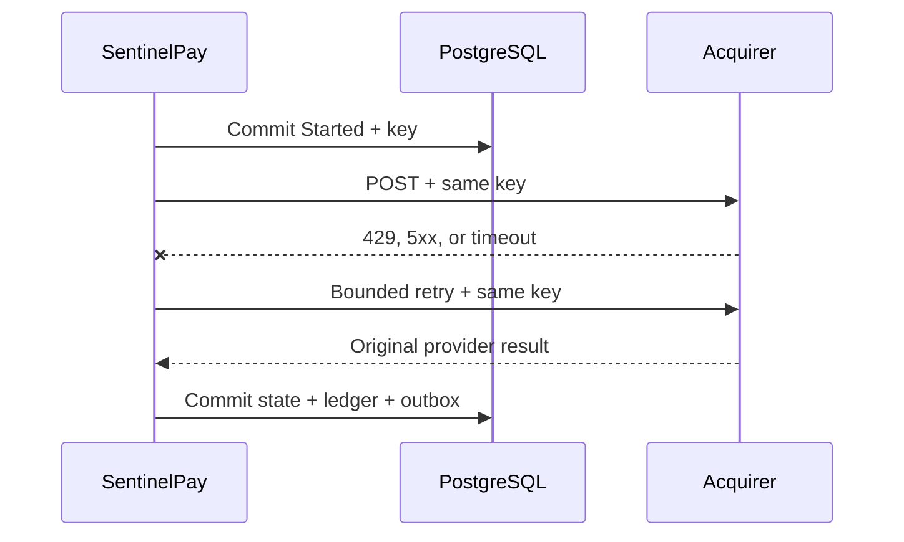

# Ten-minute payment-systems walkthrough

This walkthrough is designed for a live architecture or backend interview. It shows one coherent payment story instead of touring folders.

## Before the call

```bash
make up
curl --fail http://localhost:8080/health/ready
curl --fail http://localhost:8090/health
```

Keep the API Swagger page, RabbitMQ management page, and this document open. Run `make interview` once before the call, but do not present saved output as if it were a live run.

## Minute 0–1: frame the problem

> SentinelPay is a multi-tenant payment reliability service. Its main concern is not the happy-path HTTP endpoint; it is preserving one financial outcome when clients, providers, databases, and message brokers can fail independently.

Name the five invariants:

1. An idempotency key cannot represent two different requests.
2. Captures plus closed authorization cannot exceed the authorized amount.
3. Refunds cannot exceed captured funds.
4. Every financial movement produces a balanced journal exactly once locally.
5. Events are delivered at least once, so consumers deduplicate before committing a side effect.

## Minute 1–3: show 3DS as a state machine

Run:

```bash
make interview
```

Pause after step 1. The initial authorization returns `RequiresAction` and an HTTPS `nextAction`; it does not pretend that a challenge is a failure. Point to:

- `Payment.MarkAuthenticationRequired`
- `PaymentService.ConfirmAuthenticationAsync`
- `ProviderHttpGateway.CompleteAuthenticationAsync`

Explain that challenge timeout, authentication failure, webhook completion, and merchant confirmation all converge on the same aggregate transitions. No PAN or CVV crosses the API; only a provider token is forwarded and fingerprinted.

## Minute 3–5: demonstrate partial capture and void

The demo captures 4,000 of 10,000 minor units and then voids the 6,000 remainder. Open the final payment JSON and call out:

- `capturedAmountMinor = 4000`
- `voidedAmountMinor = 6000`
- `remainingAuthorizedAmountMinor = 0`
- one immutable capture child record
- separate durable `Capture` and `Void` operations

The ledger journal uses the capture identity and its 4,000 amount—not the payment's cumulative captured total. That distinction prevents the second capture from reposting the first capture to the ledger.

## Minute 5–7: explain the ambiguous HTTP outcome

Use `tok_http_rate_limited` or discuss `tok_http_timeout`.



The important answer is not “we use retries.” The answer is:

- business declines are not retried;
- transient HTTP responses use a small timeout/retry budget;
- every mutation retry carries the same provider idempotency key;
- if all attempts are ambiguous, the local operation remains `Started`;
- a later client retry or reconciliation resumes from durable intent.

## Minute 7–8: show at-least-once consumption

Open `AuditEventConsumer` and trace this order:

1. receive with manual acknowledgement;
2. parse and validate the CloudEvent envelope;
3. check `(consumer, eventId)`;
4. insert the inbox/audit side effect;
5. commit PostgreSQL;
6. ACK RabbitMQ.

If the process stops between commit and ACK, redelivery finds the same event ID and ACKs without applying another local side effect. Malformed messages are rejected to the audit DLQ. Transient database failures are requeued.

Do not call this exactly-once delivery. It is at-least-once transport with an idempotent local consumer boundary.

## Minute 8–9: reconcile a provider report

The demo uploads a CSV row whose captured amount and state deliberately disagree with local state. The result is `ReviewRequired` with typed issues.

Explain why the import does not automatically “fix” financial mismatches: a settlement report can reveal missing captures, currency errors, duplicate files, or a wrong reporting window. Silent mutation would destroy evidence. The online reconciliation worker applies only narrow forward repairs from a provider status endpoint; the report workflow preserves wider discrepancies for review.

## Minute 9–10: close with trade-offs

Use three honest boundaries:

- Two database commits per provider mutation create write amplification but preserve durable ambiguity state.
- Redis reduces concurrent calls but PostgreSQL constraints, row versions, the aggregate, and provider idempotency remain the correctness barriers.
- The local simulator proves the adapter contract and failure behavior; it does not claim a certified gateway integration or PCI scope.

Finish with the question you would ask before productionizing:

> Which providers and payment methods define the first SLA, and what are their exact idempotency, authorization-expiry, webhook, and reconciliation contracts?

That shifts the discussion from generic architecture to provider-specific operational reality.

## Likely follow-up questions

| Interview question | Short answer |
|---|---|
| Why not one transaction around the provider call? | PostgreSQL cannot atomically commit the provider. Holding locks across an unbounded network call makes availability worse without removing ambiguity. |
| Why store both totals and capture rows? | Totals enforce fast aggregate rules; immutable child records and journals explain how the totals were reached. |
| What if the provider lacks idempotency? | Replace blind retry with provider lookup, merchant reference search, delayed reconciliation, or manual review. The same guarantee cannot be claimed. |
| Why no retry on a decline? | A decline is a completed business result, not a transient transport failure. |
| What prevents over-capture on two nodes? | Merchant/payment lease, durable unique operation identity, aggregate remainder validation, row-version conflict, and provider idempotency. |
| Can Redis loss corrupt money state? | Mutations fail closed with a retryable response. Redis is coordination, while durable correctness remains in PostgreSQL, the aggregate, and provider contract. |
| How would you add chargebacks? | A separate dispute aggregate and ledger postings, not another mutable flag on `Payment`. |
