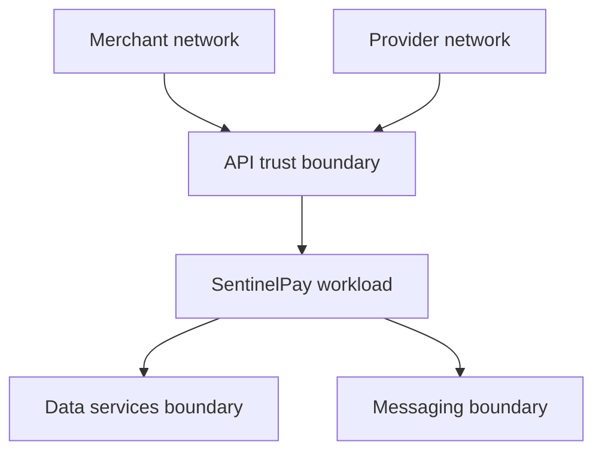

# SentinelPay threat model

## Scope and assets

SentinelPay is a service-to-service sandbox payment orchestrator. The protected assets are payment state, merchant identity, idempotency identities, provider references, ledger journals, settlement batches, event intent, webhook secrets, API keys, and audit evidence.

Raw PAN, CVV, bank credentials, and real payout instructions are explicitly outside the system boundary.

## Trust boundaries

| Boundary | Controls in this repository |
|---|---|
| Merchant → API | Hashed API key lookup, scopes, merchant partitioning, rate limits, TLS assumed at ingress |
| Provider → webhook | Timestamped HMAC, constant-time comparison, replay tolerance, inbox deduplication |
| API → provider | Tokenized identifiers, durable operation identity, bounded HTTP policy, provider idempotency |
| Workload → PostgreSQL | Parameterized EF Core queries, foreign keys, unique constraints, optimistic concurrency |
| Workload → Redis | Namespaced keys, random lease token, compare-and-delete release |
| Workload → RabbitMQ | Authenticated URI, durable exchange/queue, persistent messages, confirms, mandatory publish |

## Threat analysis

| Threat | Attack or failure | Mitigation | Residual risk / production work |
|---|---|---|---|
| Spoofing | Stolen merchant API key | Store only hash; support expiry/revocation; scope every route | Add managed issuance, short rotation windows, mTLS/workload identity, anomaly detection |
| Spoofing | Forged provider webhook | Provider-specific HMAC and timestamp validation | Store secrets in a secrets manager; support overlap during rotation |
| Tampering | Reuse key with changed amount | Constant-time request-fingerprint comparison and `409` | Canonicalization must remain version-stable |
| Tampering | Manual ledger row edits | Append-only domain API, balanced journals, diagnostic query | Enforce database privileges/audit triggers and dual approval |
| Repudiation | Client disputes mutation | Operation history, trace ID, provider reference, inbox/outbox records | Add immutable audit store and identity metadata |
| Information disclosure | Cross-merchant object lookup | Merchant derived from credential; tenant predicate on reads/mutations | Add automated query-policy review as the model grows |
| Information disclosure | Error leaks provider/internal data | Generic problem details; structured server logs | Apply log redaction and retention controls |
| Denial of service | Request flood | Merchant-partitioned fixed-window limiter | Add edge WAF, adaptive limits, quotas, body-size/time limits |
| Denial of service | Poison event blocks delivery | Manual ACK consumer, envelope validation, dedicated consumer DLQ | Add authorized operator replay workflow |
| Elevation of privilege | Broad API-key scope | Explicit route policies and scope claims | Add least-privilege issuance and authorization audit tests |
| Replay | Captured webhook resent | Five-minute signature window and inbox uniqueness | Provider clock skew and secret leakage still require monitoring |
| Race | Concurrent capture/refund | Redis lease, operation uniqueness, row version, state machine | Distributed locks are advisory; provider-native idempotency remains required |
| Ambiguous outcome | Timeout after provider accepted | Durable Started operation and same-key resume | Provider must support lookup/idempotency; otherwise manual reconciliation |
| Open redirect | Provider supplies malicious 3DS action | Require an absolute HTTPS URL and bounded value | Production adapter should enforce provider-owned host allowlists |
| Spreadsheet/report abuse | Oversized or malformed reconciliation CSV | 2 MiB/10k-row caps, strict header/types, bounded fields, tenant scope | Add malware scanning and object-store quarantine for external files |

## Abuse cases

### Cross-tenant enumeration

An authenticated merchant guesses another payment UUID. The storage query includes both payment ID and authenticated merchant ID, so the response is `404` without confirming whether the target exists. An integration test protects this behavior.

### Refund amplification

An attacker submits concurrent partial refunds. A merchant/payment lease serializes normal traffic, the domain checks remaining captured balance before provider invocation, operation keys are unique, and the payment row version catches stale writes.

### Webhook replay with modified body

Changing the event body invalidates the HMAC because the exact raw bytes are signed. Reusing the original body outside the tolerance fails timestamp validation; redelivery inside the tolerance is deduplicated by `(provider, eventId)`.

### Broker routing loss

Mandatory publish plus publisher confirms surfaces unroutable or rejected messages. The outbox keeps event intent and eventually dead-letters repeated failures rather than silently discarding them.

### Consumer redelivery after commit

The consumer commits a unique `(consumer,eventId)` inbox/audit row before ACK. If the ACK is lost, redelivery finds the committed identity and produces no second database effect. This does not make arbitrary downstream network effects exactly once; each consumer must own an idempotent boundary.

## Security assumptions

- TLS is terminated by a trusted ingress and internal dependency connections are protected by the deployment network.
- PostgreSQL, Redis, RabbitMQ, and observability credentials are injected outside source control in non-development environments.
- Provider adapters correctly implement native idempotency and signature rules.
- Operators do not mutate financial records directly without controlled compensating entries.
- Hosts and container runtime are patched and monitored.

## Explicit gaps

This reference does not include a key-management control plane, secrets manager integration, fine-grained operator roles, immutable external audit sink, inbox/outbox retention jobs, field-level encryption, WAF, mTLS, certified provider integration, payout rail, chargebacks, or PCI DSS controls. These are deployment/product responsibilities, not implied by the sample.
